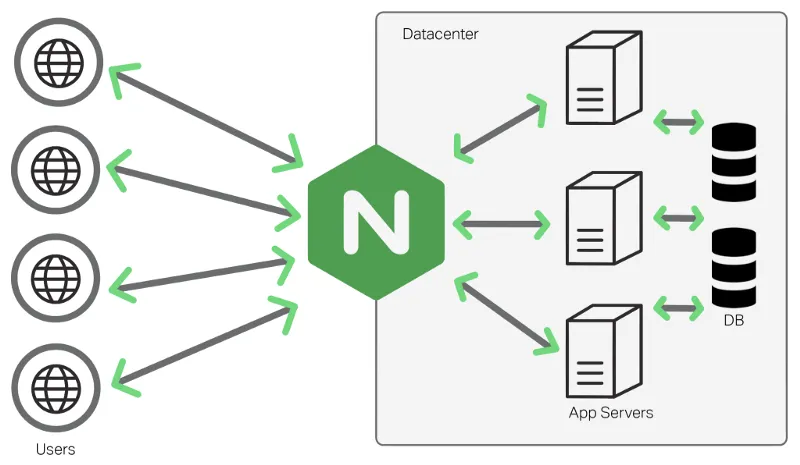

# Additional Information for Assignment 2

## What is Nginx

Nginx is open source software for web serving, reverse proxying, caching, load balancing, media streaming, and more. It started out as a web server designed for maximum performance and stability. In addition to its HTTP server capabilities, Nginx can also function as a proxy server for email (IMAP, POP3, and SMTP) and a reverse proxy and load balancer for HTTP, TCP, and UDP servers.

<p align="center">
  
</p>


Nginx can be used as a load balancer. Load balancing across multiple application instances is a commonly used technique for optimizing resource utilization, maximizing throughput, reducing latency, and ensuring fault‑tolerant configurations. The figure above shows an example of how a load balancer distributes client requests to 3 app servers.


## Prepare an Nginx Config File

Nginx uses a configuration file called `nginx.cfg` to configure its functions. If we want to use it as a load balancer, here is the [documentation](https://docs.nginx.com/nginx/admin-guide/load-balancer/http-load-balancer/) how to install and configure Nginx using Ansible. Here is a sample snippet of `nginx.cfg` to use it as a load balancer.

```
upstream backend {
    server 1.2.3.4:5000; # backend service 1
    server 1.2.3.4:6000; # backend service 2
}

server {
    location / {
        proxy_pass http://backend; # forward all requests to backend upstream
    }
}

```

## Install and Configure Nginx

Instead of installing Nginx as an additional container using Docker Compose, we install Nginx on `localhost`, which means the Codespaces instance we are using. Here is an sample Play that installs Nginx. Note the line `hosts: localhost`. Here is an [article](https://cumioyemike.medium.com/build-and-deploy-an-nginx-load-balancing-infrastructure-using-ansible-and-vagrant-6fe8f570abd9) how to use Ansible to install and configure Nginx. The key tasks of the play we need is shown below.

```yaml
- name: Play - Install and configure Nginx as a LoadBalancer
  hosts: localhost
  become: yes
  tasks:
    - name: Update cache
      apt: update_cache=yes   
    - name: Install Nginx
      # TODO
    - name: Copy the Nginx config file to /etc/nginx/sites-available
      # TODO
      become: yes
    - name: Create symlink of the config file at /etc/nginx/sites-enabled
      # TODO
    - name: Restart nginx to apply changes
      # TODO
```

## Test the LoadBalancer

First, check if Nginx is installed and running.
```bash
$ service nginx status
 * nginx is running
```
Then check if Nginx config file is present.
```bash
$ ls -l /etc/nginx/sites-enabled/
total 0
lrwxrwxrwx 1 root root 36 Mar 12 06:45 default -> /etc/nginx/sites-available/nginx.cfg
```

Last, check if the load balancer is working as expected. Visit http://0.0.0.0. The returned text will be from the backend services. We should see that the backend services will take turns to serve each request.
```bash
$ curl http://0.0.0.0
Hello World from managedhost-app-1
$ curl http://0.0.0.0
Hello World from managedhost-app-2
$ curl http://0.0.0.0
Hello World from managedhost-app-3
$ curl http://0.0.0.0
Hello World from managedhost-app-1 
$ curl http://0.0.0.0
Hello World from managedhost-app-2
$ curl http://0.0.0.0
Hello World from managedhost-app-3
...
```

## Reinstalling Nginx

If there are errors when you install and configure Nginx, use the following Play to completely uninstall Nginx before you retry installing and configuring it.

```yaml
# Uninstall Nginx
- name: Play - Uninstall Nginx
  hosts: localhost
  become: yes
  tasks: 
    - name: Unnstall Nginx
      apt: name=nginx state=absent
```
Then, run the following command to purge all Nginx configs:
```bash
$ sudo apt purge nginx nginx-common nginx-full
```

## Ansible Python API

For the Python API, we should use the Python `ansible-runner` library.

## References

* [Using Runner as a Python Module Interface to Ansible](https://ansible-runner.readthedocs.io/en/latest/python_interface.html)

## Python Library Installation

```bash
$ pip install ansible-runner
```
Your code should import `ansible_runner` library.

```python
import ansible_runner

# Write your answer here by modifying or extending the sample code below
```
